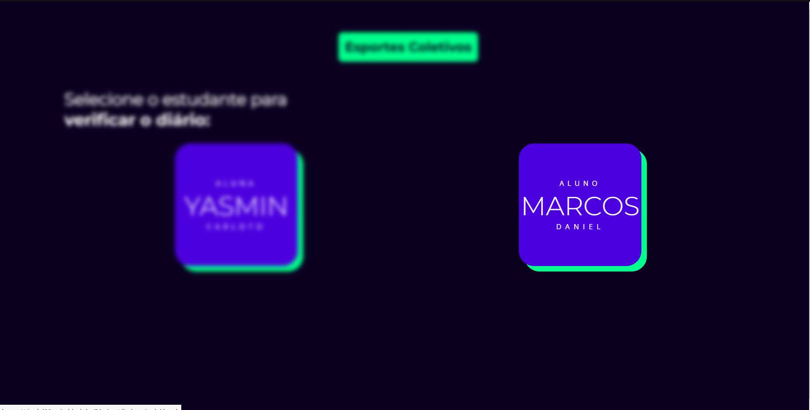
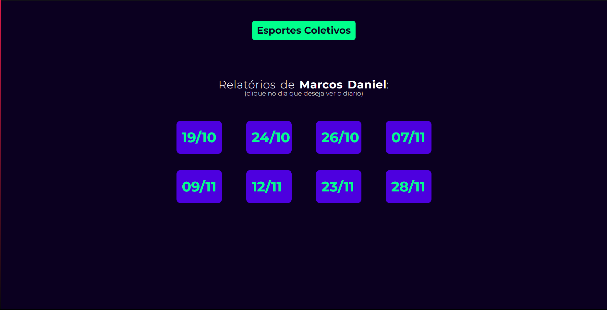
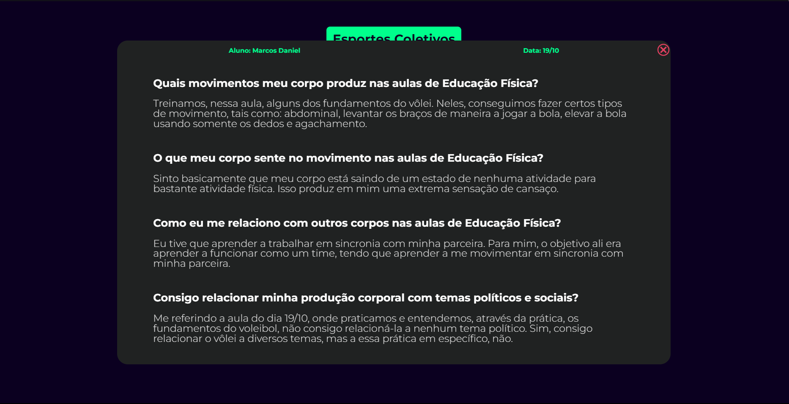

# Diarios
<h5>Esse projeto foi destinado à matéria de Educação Física III do Instituto Federal do Ceará, onde fomos desafiados a mostrar nossas experiências em cada 
uma das aulas, respondendo à algumas perguntas, de maneira criativa.</h5>

[Link para a aplicação web](https://daniel02md.github.io/Diarios/).

<h2>Screenshots</h2>

Utilizamos como tecnologias principais: HTML5, CSS3, JavaScript com JQuery.
